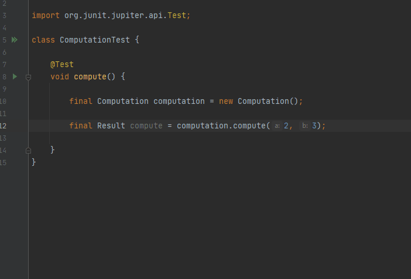

# assert-generator-intellij-plugin

<!-- Plugin description -->
## Plugin for Intellij to generate JUnit 4/5 asserts

Provides actions for generating assertions for all getters of variables.
The plugin currently supports basic assertions for JUnit 4/5.

## How to Use
Move the caret to a local variable and open the context menu using the intention bulb or with the shortcut ALT+ENTER.
Then select generate assert depending your JUnit version.

<!-- Plugin description end -->

## Installation

- Using IDE built-in plugin system:
  
  <kbd>Settings/Preferences</kbd> > <kbd>Plugins</kbd> > <kbd>Marketplace</kbd> > <kbd>Search for "assert-generator-intellij-plugin"</kbd> >
  <kbd>Install Plugin</kbd>
  
- Manually:

  Download the [latest release](https://github.com/jbardel/assert-generator-intellij-plugin/releases/latest) and install it manually using
  <kbd>Settings/Preferences</kbd> > <kbd>Plugins</kbd> > <kbd>⚙️</kbd> > <kbd>Install plugin from disk...</kbd>

---
Plugin based on the [IntelliJ Platform Plugin Template][template].

[template]: https://github.com/JetBrains/intellij-platform-plugin-template
